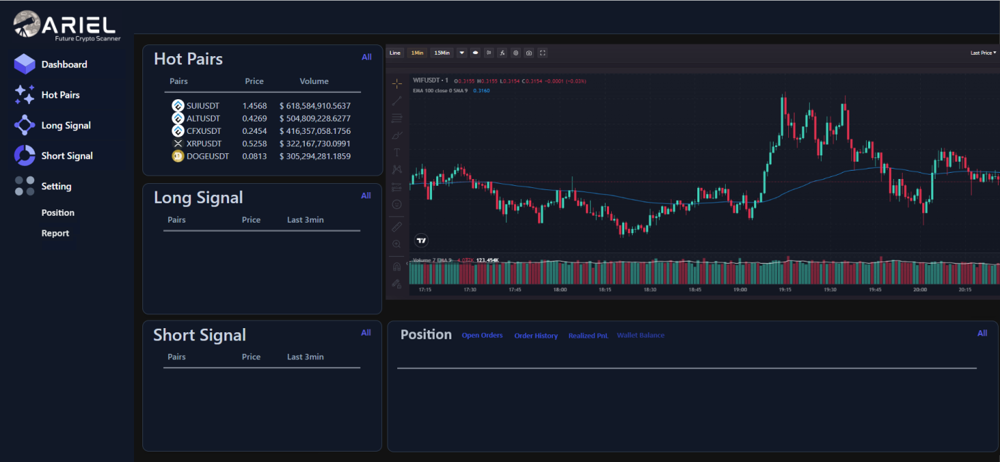

# Future Crypto Scanner

> AIM: Indentifying potential long and short trading opportunities in crypto future contracts.

## Demo

## Long Opportunities
- Price Range: The contract's price should fall within the range of $0.9 to $2.99 USDT.
- Volume Threshold: The trading volume must exceed 1 million USDT.
- Price Acceleration: A minimum price acceleration of 2% within a maximum time frame of 3 minutes. For instance, if the price starts at $1.00 at 8:00 PM, it should reach $1.02 by 8:03 PM.
- Buyer Volume Surge: The volume of buyers should exhibit a noticeable increase above the average within the 3-minute interval.

## Short Opportunities
- Price Range: The contract's price should fall within the range of $0.9 to $2.99 USDT.
- Volume Threshold: The trading volume must exceed 1 million USDT.
- Price Decrease: A minimum price decrease of 2% within a maximum time frame of 3 minutes. For instance, if the price starts at $1.02 at 8:00 PM, it should decrease to $1.00 by 8:03 PM.
- Seller Volume Surge: The volume of sellers should exhibit a noticeable increase above the average within the 3-minute interval.
